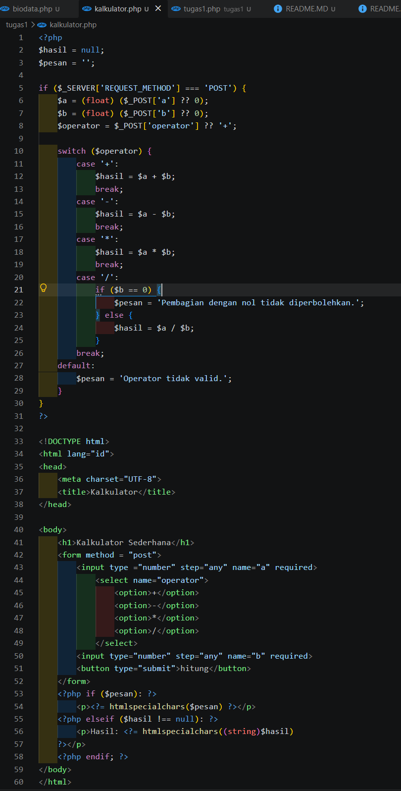
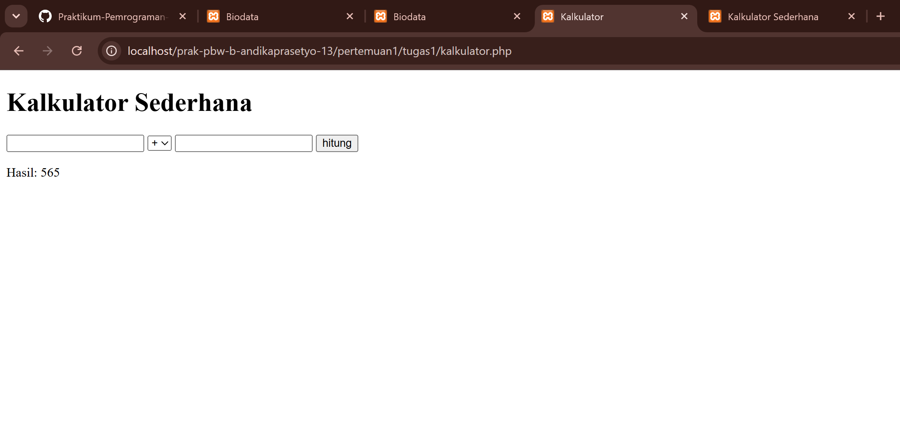
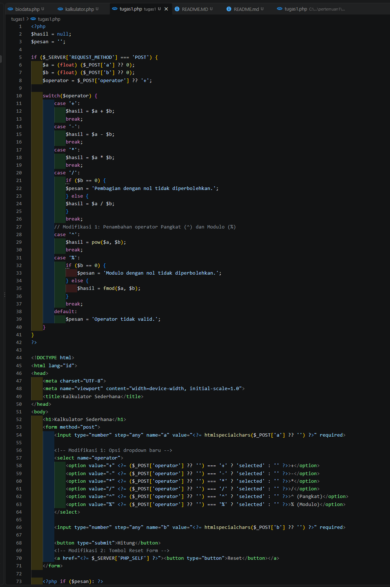
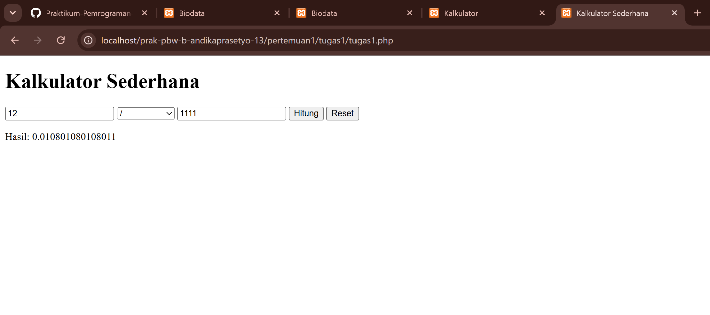

# Laporan Tugas 1 - Praktikum Pemrograman Web (PBW)

## Screenshot Program

### 1. Sebelum Modifikasi

### 2. Sesudah Modifikasi

---

## Modifikasi yang Dilakukan
1. **Penambahan Operator Pangkat (^) dan Modulo (%)**: Menambahkan fitur perhitungan sisa bagi dan perpangkatan pada `switch-case`.
2. **Styling Interface (CSS)**: Mengubah tampilan form menjadi berbentuk *card* yang rapi dan memanjakan mata.
3. **Penyimpanan Nilai Input**: Nilai pada input box tidak hilang saat tombol "Hitung" diklik.

---

## 5 Bagian Kode Penting
1. `if ($_SERVER['REQUEST_METHOD'] === 'POST')`: Memastikan skrip PHP hanya berjalan jika form dikirimkan via method POST.
2. `(float) ($_POST['a'] ?? 0)`: Konversi otomatis tipe data ke *float* dan penggunaan *null coalescing operator* untuk menghindari error variabel kosong.
3. `switch ($operator)`: Pengatur alur utama eksekusi kalkulasi berdasarkan operator terpilih.
4. `if ($b == 0)`: Validasi kritis untuk mencegah error *Division by zero*.
5. `htmlspecialchars()`: Memastikan output yang ditampilkan bebas dari potensi celah keamanan XSS.

---

## Analisis Error
* **Error:** `Fatal error: Uncaught DivisionByZeroError: Division by zero`
* **Penyebab:** Melakukan pembagian matematika dengan nilai nol ($b = 0).
* **Solusi:** Menambahkan penanganan percabangan `if ($b == 0)` sebelum operasi pembagian/modulo dijalankan.