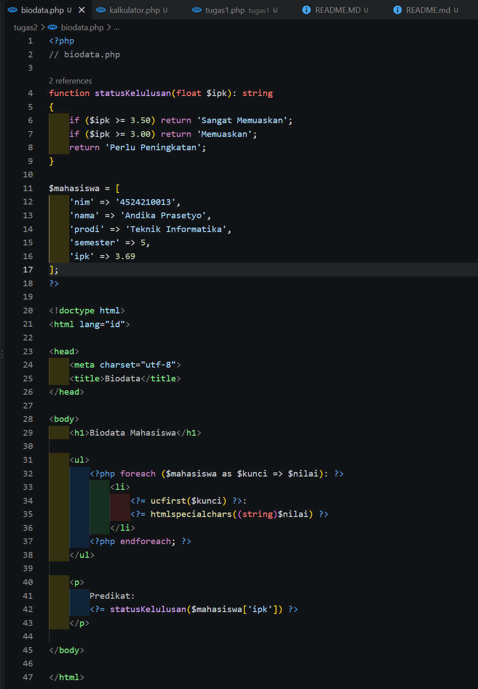
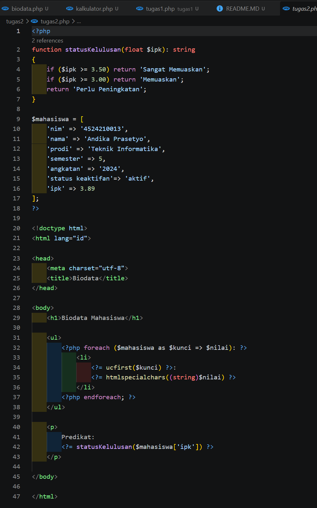
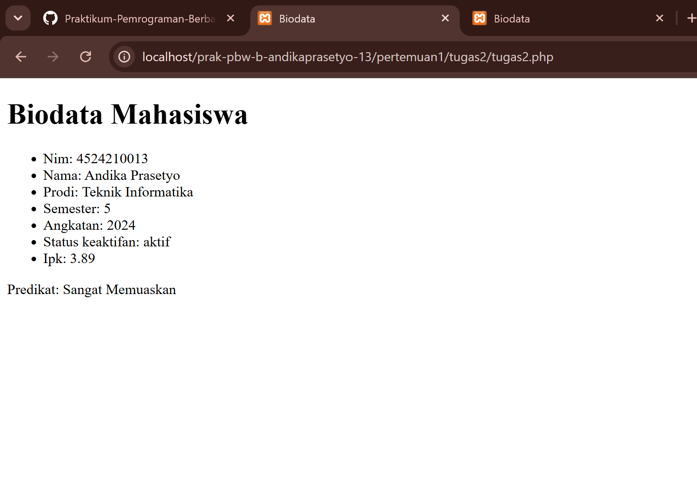

# Laporan Tugas 1 - Praktikum Pemrograman Web (PBW)

## Screenshot Hasil Pengerjaan

### 1. Sebelum Modifikasi

### 2. Sesudah Modifikasi

---

## Modifikasi Kode
1. **Penambahan Field Baru & Kriteria Predikat**: Menambahkan field `email` & `status_beasiswa`, serta opsi predikat `Dengan Pujian (Cum Laude)` jika IPK >= 3.75.
2. **Redesain Tampilan (CSS Card & Table)**: Mengubah tampilan berbasis list `<ul>` menjadi bentuk tabel di dalam *card* agar responsif dan modern.
3. **Pembersihan Nama Field & Badge Status**: Menghapus karakter *underscore* (`_`) pada nama field menggunakan `str_replace()`, serta menambahkan *badge* indikator warna hijau untuk status beasiswa.

---

## 5 Bagian Kode Penting
1. `function statusKelulusan(float $ipk): string`: Fungsi dengan *type hinting* untuk memproses logika predikat secara independen.
2. `Array Asosiatif $mahasiswa`: Struktur data tempat menyimpan seluruh atribut informasi mahasiswa.
3. `foreach ($mahasiswa as $kunci => $nilai)`: Perulangan dinamis untuk membaca pasangan *key-value* dari array.
4. `htmlspecialchars()`: Pengamanan data dari celah XSS sebelum dirender ke browser.
5. `statusKelulusan($mahasiswa['ipk'])`: Eksekusi fungsi dengan passing data variabel array secara spesifik.

---

## Analisis Error
* **Error:** `TypeError: statusKelulusan(): Argument #1 ($ipk) must be of type float, string given`
* **Penyebab:** Menuliskan nilai IPK menggunakan tanda petik `'3.69'` (bertipe String) padahal fungsi meminta tipe `float`.
* **Solusi:** Mengubah penulisan nilai IPK tanpa tanda petik `3.69` atau melakukan type casting `(float)$mahasiswa['ipk']`.